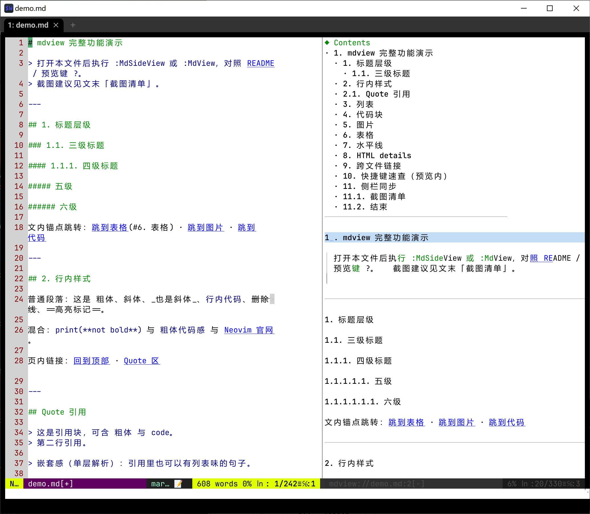

# nvimplugins

**English** | [中文](README.zh.md)

> **About** — Small experimental Neovim plugins: **mdview** (Markdown preview), **music** (open audio and play in a buffer), **imgbuf** (terminal image preview), **nvimgames** (Minesweeper / Sokoban / 24-point / Tetris), **drawbuf** (Unicode block drawing). Each plugin installs independently; no hard dependencies.

Focused on fun, practical, low-dependency terminal tooling. Install via **local path** (vim-plug / lazy.nvim / `rtp`).

**Two install styles (pick one):**

| Style | Description |
|-------|-------------|
| **Whole repo** | Point a single `Plug` / `dir` at the repo root `nvimplugins/`; all sub-plugins load automatically |
| **Per plugin** | Install only the subfolders you need (e.g. `…/mdview`) |

## Plugins

| Plugin | Overview | Docs |
|--------|----------|------|
| **[mdview](mdview/)** | Markdown preview inside Neovim: single-window reading (`:MdView`) or side-by-side source (`:MdSideView`). Pure Lua rendering for headings/lists/GFM tables/code blocks (optional Tree-sitter), TOC, link & anchor jumps, images rendered with block characters, and optional terminal HD overlays. | [EN](mdview/README.md) · [中文](mdview/README.zh.md) |
| **[music](music/)** | Open an audio file and turn the buffer into a player: play/pause, scrubbable progress bar, volume, prev/next in the same folder, track list, LRC lyrics sync, session restore. Python daemon backend (`just_playback` / pygame); hide UI without stealing focus. | [EN](music/README.md) · [中文](music/README.zh.md) |
| **[imgbuf](imgbuf/)** | Open images as character-art previews (block / half / braille); fill or fit scaling; auto-open, clipboard, file-tree friendly; optional pixel HD overlay on WezTerm/Kitty/Ghostty (chafa or Python+Pillow). | [EN](imgbuf/README.md) · [中文](imgbuf/README.zh.md) |
| **[nvimgames](nvimgames/)** | Terminal mini-games: Minesweeper, Sokoban (bundled levels), 24-point poker, Tetris (special pieces + optional vs AI). Launch from `:NvimGames` float menu. | [EN](nvimgames/README.md) · [中文](nvimgames/README.zh.md) |
| **[drawbuf](drawbuf/)** | Draw with Unicode block characters in a buffer: pencil/eraser/line/rect/ellipse/fill, truecolor palette, clickable status bar, undo/redo, `.draw` files, and built-in demo pictures. | [EN](drawbuf/README.md) · [中文](drawbuf/README.zh.md) |

## Screenshots

| mdview (side) | music | imgbuf |
|:--------------:|:-----:|:------:|
|  |  |  |

| Minesweeper | Sokoban | 24-point | Tetris |
|:-----------:|:-------:|:--------:|:------:|
|  |  |  |  |

| drawbuf |
|:-------:|
|  |

More mdview shots: [mdview/testdata/screenshots/](mdview/testdata/screenshots/) and demo [mdview/testdata/demo.md](mdview/testdata/demo.md).

## Dependencies (summary)

| Plugin | Neovim | Other |
|--------|--------|-------|
| mdview | 0.9+ | Core needs nothing extra; block-character images need Pillow (or chafa); code highlight optional Tree-sitter; pixel HD needs a graphics-protocol terminal |
| music | 0.9+ | Python3 + **just_playback** (or pygame fallback) |
| imgbuf | 0.9+ | chafa **or** Python3 + Pillow; HD needs WezTerm/Kitty/Ghostty + Pillow |
| nvimgames | 0.9+ | `termguicolors`; Minesweeper benefits from `mouse=a`; Sokoban ships `data/levels.json` |
| drawbuf | 0.9+ | `termguicolors`; `mouse=a` recommended |

## Quick install

Replace paths with your local directory. **No** shared `setup()` is required (call `require(...).setup` only when tuning options).  
Do **not** mix whole-repo and per-plugin installs for the same plugins. Double-load is mostly guarded by `loaded_*`, but `rtp` would list paths twice.

### Style A: whole repo (all plugins)

Root `plugin/nvimplugins.lua` appends each subfolder to `runtimepath` and sources their `plugin/` files.

#### vim-plug

```vim
call plug#begin()
Plug '/path/to/nvimplugins'
call plug#end()
```

To enable only some plugins, set this **before** `plug#end()` (names match directory names):

```vim
let g:nvimplugins_enable = ['mdview', 'music', 'imgbuf']
call plug#begin()
Plug '/path/to/nvimplugins'
call plug#end()
```

#### lazy.nvim

```lua
{
  dir = "/path/to/nvimplugins",
  name = "nvimplugins",
  lazy = false,
  -- optional subset (must apply before plugin load; or use init)
  -- init = function()
  --   vim.g.nvimplugins_enable = { "mdview", "music", "imgbuf" }
  -- end,
}
```

### Style B: per plugin (only what you need)

#### vim-plug

```vim
call plug#begin()
Plug '/path/to/nvimplugins/mdview'
Plug '/path/to/nvimplugins/music'
Plug '/path/to/nvimplugins/imgbuf'
Plug '/path/to/nvimplugins/nvimgames'
Plug '/path/to/nvimplugins/drawbuf'
call plug#end()
```

#### lazy.nvim (example)

```lua
{
  { dir = "/path/to/nvimplugins/mdview", name = "mdview", lazy = false },
  { dir = "/path/to/nvimplugins/music", name = "music", lazy = false },
  { dir = "/path/to/nvimplugins/imgbuf", name = "imgbuf", lazy = false },
  { dir = "/path/to/nvimplugins/nvimgames", name = "nvimgames", lazy = false },
  { dir = "/path/to/nvimplugins/drawbuf", name = "drawbuf", lazy = false },
}
```

Per-plugin install details live in each subdirectory README (mdview has tiers ① minimal → ③ full).

## Doc index

| Plugin | Entry |
|--------|-------|
| mdview | [EN](mdview/README.md) · [中文](mdview/README.zh.md) · [demo](mdview/testdata/demo.md) · [screenshots](mdview/testdata/screenshots/) |
| music | [EN](music/README.md) · [中文](music/README.zh.md) |
| imgbuf | [EN](imgbuf/README.md) · [中文](imgbuf/README.zh.md) |
| nvimgames | [EN](nvimgames/README.md) · [中文](nvimgames/README.zh.md) |
| drawbuf | [EN](drawbuf/README.md) · [中文](drawbuf/README.zh.md) |

## License / notes

Personal / prototype collection. Copy subfolders as needed. Prefer filing issues and changes under the matching plugin directory.
