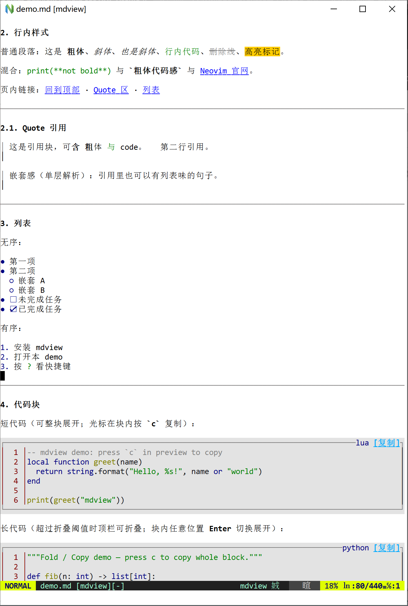
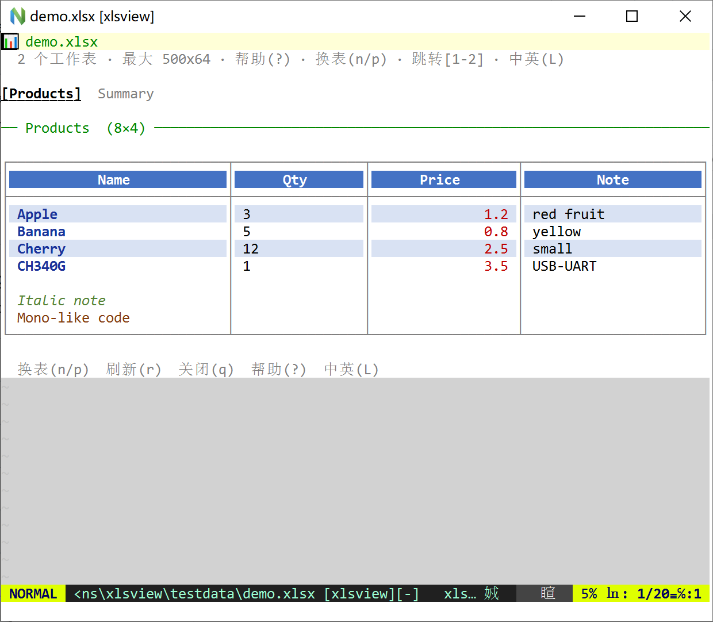
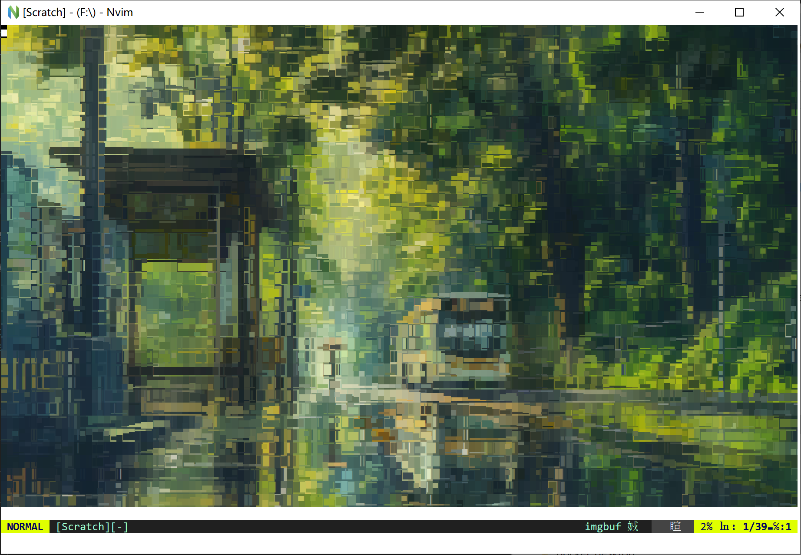
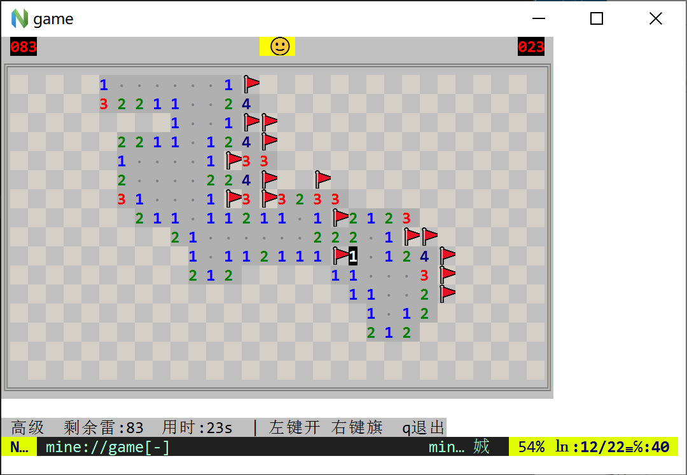
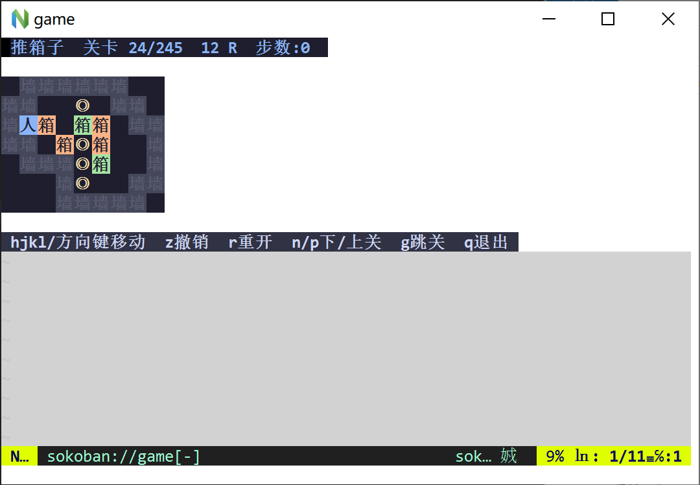
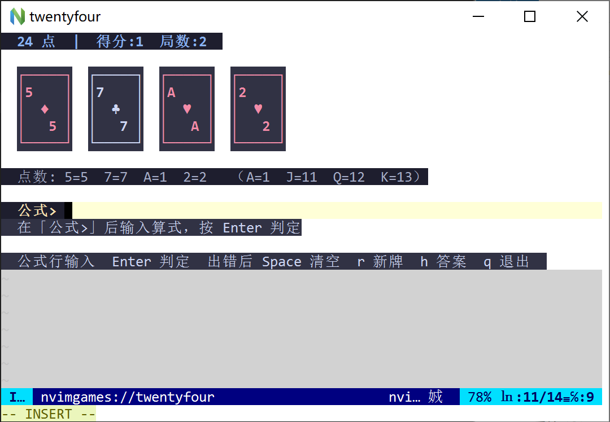
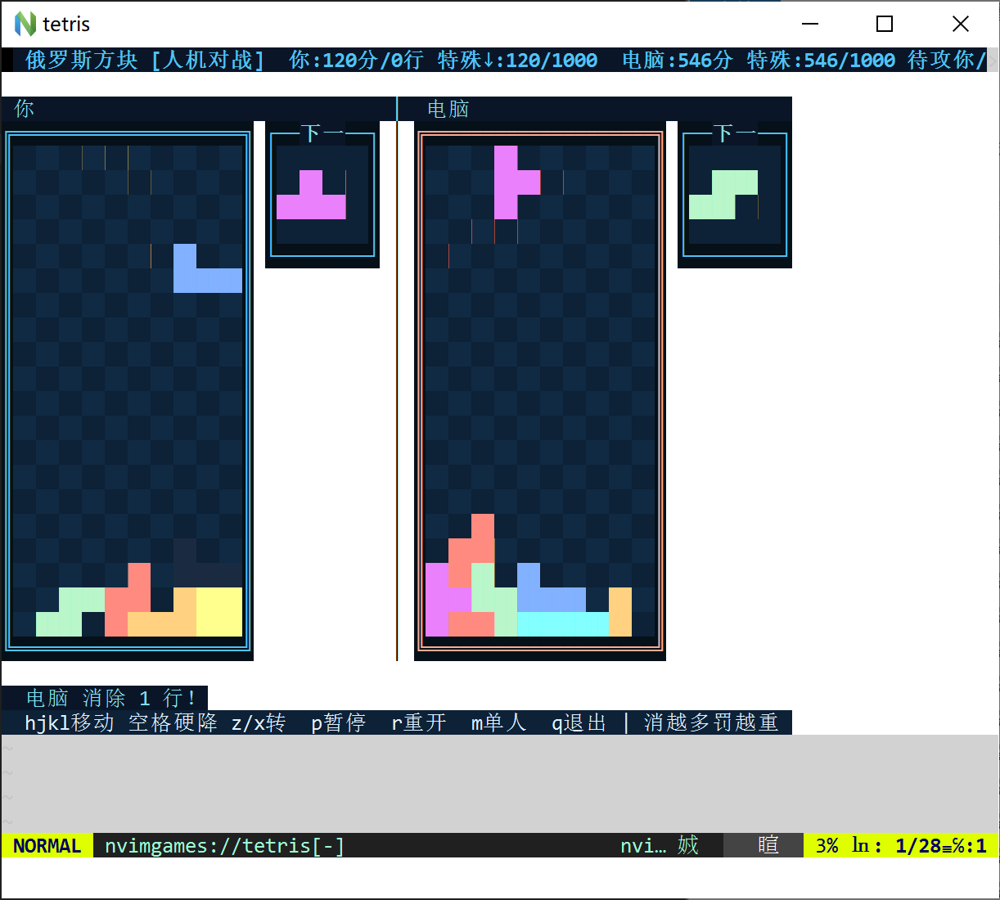
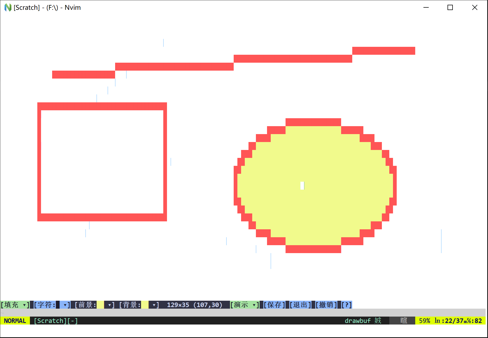
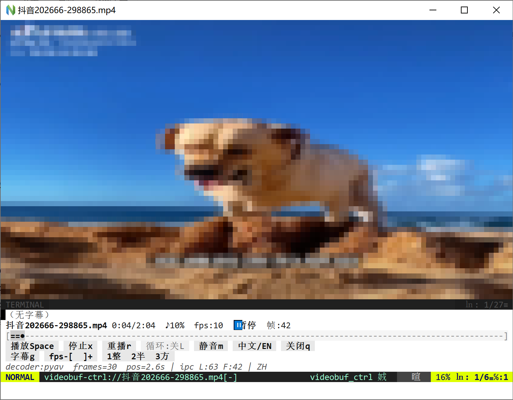
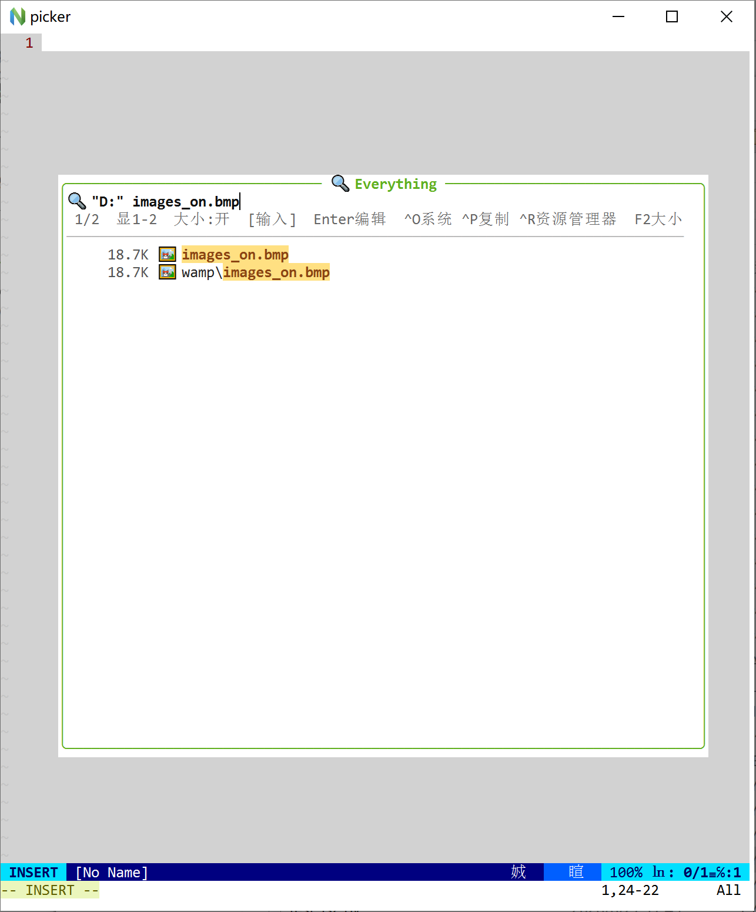

# nvimplugins

**English** | [中文](README.zh.md)

> **About** — Small experimental Neovim plugins: **mdview** (Markdown preview), **pdfview** / **xlsview** (document previews), **tts** (Windows SAPI speech), **imgbuf** (images), **music** (audio + Windows MIDI), **nvimgames** (mini-games), **drawbuf** (block drawing), **videobuf** (video), **es** (Everything file search), **qrbuf** (QR codes), **httpbuf** (HTTP scratch), **weather** (forecast). Each plugin installs independently; no hard dependencies.

Focused on fun, practical, low-dependency terminal tooling. Most UIs support **Chinese / English** (default: follow system language; preference is remembered).

**Two install styles (pick one):**

| Style | Description |
|-------|-------------|
| **Whole repo (network)** | One line: `Plug 'cfwang123/nvimplugins'` — root `plugin/nvimplugins.lua` auto-loads all sub-plugins |
| **Per plugin (local path)** | Plug only the subfolders you need (e.g. `…/mdview`) |

## Plugins

| Plugin | Overview | Docs |
|--------|----------|------|
| **[mdview](mdview/)** | Markdown preview: single-window (`:MdView`) or side-by-side (`:MdSideView`). Headings/lists/GFM tables/code, TOC, anchors, block-character images, optional terminal HD. **`L`** toggles UI language. | [EN](mdview/README.md) · [中文](mdview/README.zh.md) |
| **[pdfview](pdfview/)** | PDF / Word preview: text styles, tables, chafa images; Enter/click float HD; `gh` temporary page HD. **`L`** toggles language. | [EN](pdfview/README.md) · [中文](pdfview/README.zh.md) |
| **[xlsview](xlsview/)** | Excel (.xlsx/.xlsm) preview: cell color/bold/fill, multi-sheet, width-fit columns. **`L`** toggles language. | [EN](xlsview/README.md) · [中文](xlsview/README.zh.md) |
| **[tts](tts/)** | Windows SAPI TTS: `<leader>vo` starts from the **segment at the cursor** (press again to jump while playing); white control bar; volume wheel / rate; system default audio device; **EN/中文** button or **`L`**. | [EN](tts/README.md) · [中文](tts/README.zh.md) |
| **[imgbuf](imgbuf/)** | Image as character art (block/half/braille); fill/fit; auto-open, clipboard; optional pixel HD on WezTerm/Kitty/Ghostty. **`L`** toggles language. | [EN](imgbuf/README.md) · [中文](imgbuf/README.zh.md) |
| **[music](music/)** | Open audio → buffer player: play/pause, scrub, volume, folder prev/next + list, LRC lyrics. **Windows MIDI** (`.mid` / presets via **winmm.dll**): `:MusicMidi` / `<leader>mx`. **`Y`** toggles language (`L` = loop). | [EN](music/README.md) · [中文](music/README.zh.md) |
| **[nvimgames](nvimgames/)** | Minesweeper, Sokoban, **24-point**, Tetris. `:NvimGames` menu. In-game **`u`** (or button) toggles language. | [EN](nvimgames/README.md) · [中文](nvimgames/README.zh.md) |
| **[drawbuf](drawbuf/)** | Unicode block canvas: pencil/eraser/line/rect/ellipse/fill, truecolor, clickable status bar, undo, `.draw` files, demos. Status **[EN/中]** or **`Y`** for language (`L` = line tool). | [EN](drawbuf/README.md) · [中文](drawbuf/README.zh.md) |
| **[videobuf](videobuf/)** | Terminal video preview (character frames + control bar); daemon-style backend similar to music. | [EN](videobuf/README.md) · [中文](videobuf/README.zh.md) |
| **[es](es/)** | Windows **Everything** file search (`es.exe`): `:ES` / `<leader>es` live float picker. | [EN](es/README.md) · [中文](es/README.zh.md) |
| **[qrbuf](qrbuf/)** | Text → terminal **QR code** float: `:QrBuf` / `<leader>qr`, selection supported. | [EN](qrbuf/README.md) · [中文](qrbuf/README.zh.md) |
| **[httpbuf](httpbuf/)** | Lightweight **HTTP** request editor + response view: `:HttpBuf` / `<leader>http`, curl or Python. | [EN](httpbuf/README.md) · [中文](httpbuf/README.zh.md) |
| **[weather](weather/)** | Statusline **city / weather / temp** + `:Weather` / `<leader>we` 10-day table; Open-Meteo public HTTP, hourly cache. | [EN](weather/README.md) · [中文](weather/README.zh.md) |
| **[ntemoji](ntemoji/)** | **NERDTree** emoji icons (no Nerd Font / no vim-devicons). | [EN](ntemoji/README.md) · [中文](ntemoji/README.zh.md) |

## UI language (zh / en)

Most plugin UIs support Chinese and English. Default is **`ui_lang = "auto"`** (system UI culture; fallback often Chinese). Manual switches are saved under `stdpath("data")/*-nvim-prefs.json`.

| Plugin | Toggle |
|--------|--------|
| mdview / pdfview / xlsview / imgbuf | **`L`** in preview |
| tts | Control bar **EN / 中文** or **`L`** |
| music | Button **EN/中(Y)** or **`Y`** (`L` = single-track loop; MIDI: **`m`** presets) |
| nvimgames (incl. 24-point) | Footer button or **`u`** |
| drawbuf | Status **[EN/中]** or **`Y`** (`L` = line tool) |
| es | **`L`** or **`Ctrl-l`** in picker (default follows system language; remembered) |
| qrbuf / httpbuf / weather | **`L`** in float |

```lua
require("mdview").setup({ ui_lang = "auto" }) -- or "zh" | "en"
require("tts").setup({ ui_lang = "en" })
```

## Screenshots

**mdview**



**pdfview** (PDF)


**xlsview**



**tts**


**imgbuf**



**music**


**nvimgames** — Minesweeper



**nvimgames** — Sokoban



**nvimgames** — 24-point



**nvimgames** — Tetris



**drawbuf**



**videobuf**



**es** (Everything file search)



More mdview shots: [mdview/testdata/screenshots/](mdview/testdata/screenshots/) and demo [mdview/testdata/demo.md](mdview/testdata/demo.md).  
TTS samples: [tts/testdata/](tts/testdata/) (`sample.zh.txt` / `sample.en.txt`).

## Dependencies (summary)

| Plugin | Neovim | Other |
|--------|--------|-------|
| mdview | 0.9+ | Core needs nothing extra; block images need Pillow (or chafa); code highlight optional Tree-sitter; pixel HD needs a graphics-protocol terminal |
| pdfview | 0.9+ | PDF: PyMuPDF; DOCX: stdlib only; DOC: optional LibreOffice; images chafa/Pillow; HD: WezTerm/Kitty/Ghostty |
| xlsview | 0.9+ | Python3 + **openpyxl** |
| tts | 0.9+ | **Windows** + SAPI; Python3 + **pywin32** |
| imgbuf | 0.9+ | chafa **or** Python3 + Pillow; HD needs WezTerm/Kitty/Ghostty + Pillow |
| music | 0.9+ | Python3 + **just_playback** (or pygame fallback) |
| music (MIDI) | 0.9+ | **Windows** + Python3 (**winmm.dll**, stdlib ctypes) — bundled in music |
| nvimgames | 0.9+ | `termguicolors`; Minesweeper benefits from `mouse=a`; Sokoban ships `data/levels.json` |
| drawbuf | 0.9+ | `termguicolors`; `mouse=a` recommended |
| videobuf | 0.9+ | Python3 + **av** (or opencv-python) + **just_playback** |
| es | 0.9+ | **Windows** + [Everything](https://www.voidtools.com/) + [es.exe CLI](https://www.voidtools.com/support/everything/command_line_interface/) |
| qrbuf | 0.9+ | Python3 (stdlib, `scripts/qrgen.py`) |
| httpbuf | 0.9+ | **curl** or Python3 (stdlib urllib) |
| weather | 0.9+ | Python3 + network (Open-Meteo public HTTP, no key) |

**Startup check**: on load, only **required** pip packages are checked; if missing you get an install prompt. Install opens a log float with live pip output and notifies when done.  
- Full check (incl. recommended): `:NvimpluginsDeps` (optional plugin names)  
- Debug probe: `:NvimpluginsDepsProbe`  
- Disable: `let g:nvimplugins_skip_deps = 1`  
- Auto-install without asking: `let g:nvimplugins_auto_install_deps = 1`  
- Recommended packages can be dismissed permanently (`stdpath('data')/nvimplugins_deps.json`)  
This repo has **no npm dependencies**.

## Bundle help

After whole-repo install:

| Action | Description |
|--------|-------------|
| **`<leader>hh`** | Help float (`g:nvimplugins_keys_help` to change) |
| **`:NvimpluginsHelp`** | Same |

Lists **commands** and **current keymaps** per plugin; lines with **▶** run on **Enter / click** (commands that need args are pre-filled on the cmdline).

## Quick install

**No** shared `setup()` is required (call `require(...).setup` only when tuning options).  
Do **not** mix whole-repo and per-plugin installs for the same plugins. Double-load is mostly guarded by `loaded_*`, but `rtp` would list paths twice.

### Style A: whole repo via vim-plug (network)

Recommended when you want **all** sub-plugins. GitHub: [cfwang123/nvimplugins](https://github.com/cfwang123/nvimplugins).

**Install is one line only** — no bootstrap in your init. After `plug#end()`, `require("imgbuf")` etc. work immediately (root `lua/*` proxies). Commands load via `plugin/nvimplugins.*` on startup.

#### vim-plug

```vim
call plug#begin()
Plug 'cfwang123/nvimplugins'
call plug#end()
```

Then run **`:PlugInstall`** once (later: `:PlugUpdate`). Optional `require("…").setup({...})` lines are configuration only, not install.

Optional subset (before load; names match directories):

```vim
let g:nvimplugins_enable = ['mdview', 'pdfview', 'xlsview', 'tts', 'imgbuf', 'music', 'nvimgames']
```

Default bundle: `mdview` · `pdfview` · `xlsview` · `tts` · `imgbuf` · `music` · `nvimgames` · `drawbuf` · `videobuf` · … · `weather` · `ntemoji`.

#### lazy.nvim

```lua
{ "cfwang123/nvimplugins", lazy = false }
```

### Style B: per plugin (local path)

#### vim-plug

```vim
call plug#begin()
Plug '/path/to/nvimplugins/mdview'
Plug '/path/to/nvimplugins/pdfview'
Plug '/path/to/nvimplugins/xlsview'
Plug '/path/to/nvimplugins/tts'
Plug '/path/to/nvimplugins/imgbuf'
Plug '/path/to/nvimplugins/music'
Plug '/path/to/nvimplugins/nvimgames'
Plug '/path/to/nvimplugins/drawbuf'
Plug '/path/to/nvimplugins/videobuf'
call plug#end()
```

#### lazy.nvim (example)

```lua
{
  { dir = "/path/to/nvimplugins/mdview", name = "mdview", lazy = false },
  { dir = "/path/to/nvimplugins/pdfview", name = "pdfview", lazy = false },
  { dir = "/path/to/nvimplugins/xlsview", name = "xlsview", lazy = false },
  { dir = "/path/to/nvimplugins/tts", name = "tts", lazy = false },
  { dir = "/path/to/nvimplugins/imgbuf", name = "imgbuf", lazy = false },
  { dir = "/path/to/nvimplugins/music", name = "music", lazy = false },
  { dir = "/path/to/nvimplugins/nvimgames", name = "nvimgames", lazy = false },
  { dir = "/path/to/nvimplugins/drawbuf", name = "drawbuf", lazy = false },
  { dir = "/path/to/nvimplugins/videobuf", name = "videobuf", lazy = false },
}
```

Per-plugin install details live in each subdirectory README (mdview has tiers ① minimal → ③ full).

### Optional `setup()` (per plugin)

**All optional.** Loading the plugin applies defaults. Call `require("…").setup({ ... })` only to override options, **after** the plugin is on `rtp` (e.g. after `plug#end()`).

```lua
-- mdview — Markdown preview
require("mdview").setup({
  split_direction = "right",
  width = 0.45,
  ui_lang = "auto", -- "auto" | "zh" | "en"; L in preview
  keys = { view = "<leader>mv", side = "<leader>ms" },
  image = {
    mode = "thumb",
    python = "python",
    float_hd = "always",
  },
})

-- pdfview — PDF / Word
require("pdfview").setup({
  auto_open = true,
  ui_lang = "auto", -- L
  python = "python",
  image = {
    backend = "chafa",
    open_with = "float",
    float_hd = "always",
  },
})

-- xlsview — Excel
require("xlsview").setup({
  auto_open = true,
  ui_lang = "auto", -- L
  python = "python",
  max_rows = 500,
  max_cols = 64,
})

-- tts — Windows SAPI speech
require("tts").setup({
  volume = 80,
  rate = 0,
  ui_lang = "auto", -- bar EN/中文 or L
  keys_play = "<leader>vo", -- from cursor segment; press again to jump
  keys_stop = "<leader>vs",
  -- voice = "Huihui", -- optional default; float choice is remembered
})

-- imgbuf — character art + optional HD
require("imgbuf").setup({
  backend = "auto",
  mode = "block",
  scale = "fill",
  hd = "always",
  ui_lang = "auto", -- L
  auto_open = true,
})

-- music — buffer audio player
require("music").setup({
  volume = 70,
  auto_open = true,
  auto_play = true,
  toggle_key = "<M-m>",
  ui_lang = "auto", -- Y toggles language; L = loop
  python = "python",
})

-- nvimgames — mini-games
require("nvimgames").setup({
  lang = "auto", -- "auto" | "zh" | "en"
  mine = { difficulty = "beginner" },
  sokoban = { remember_level = true },
  twentyfour = { solvable_only = true },
  tetris = { special_score = 1000 },
})

-- drawbuf — Unicode block drawing
require("drawbuf").setup({
  width = 80,
  height = 24,
  canvas_bg = "ffffff",
  statusline = true,
  ui_lang = "auto", -- status [EN/中] or Y
})
```

Full option lists: each plugin’s README / `lua/*/config.lua` (or `init.lua`).

## Quick commands / keys

| Plugin | Command / key | Action |
|--------|---------------|--------|
| mdview | `<leader>mv` / `<leader>ms` · `L` | Single / side preview · language |
| pdfview | open pdf/docx · `L` · `gh` | Preview · language · page HD |
| xlsview | open xlsx · `n`/`p` · `L` | Preview · sheet · language |
| tts | `<leader>vo` / `<leader>vs` · `L` | Play from cursor segment / stop · language |
| imgbuf | open image · `L` | Preview · language |
| music | open audio · `<M-m>` · `Y` | Player · toggle UI · language |
| music | `:Music` / `:MusicMidi` / `<leader>mx` · `Y` | Audio + Windows MIDI |
| nvimgames | `:NvimGames` · `u` in-game | Menu · language |
| drawbuf | `:Draw` · `Y` | Canvas · language |

## Doc index

| Plugin | Entry |
|--------|-------|
| mdview | [EN](mdview/README.md) · [中文](mdview/README.zh.md) · [demo](mdview/testdata/demo.md) · [screenshots](mdview/testdata/screenshots/) |
| pdfview | [EN](pdfview/README.md) · [中文](pdfview/README.zh.md) |
| xlsview | [EN](xlsview/README.md) · [中文](xlsview/README.zh.md) |
| tts | [EN](tts/README.md) · [中文](tts/README.zh.md) · [samples](tts/testdata/) |
| imgbuf | [EN](imgbuf/README.md) · [中文](imgbuf/README.zh.md) |
| music | [EN](music/README.md) · [中文](music/README.zh.md) |

| nvimgames | [EN](nvimgames/README.md) · [中文](nvimgames/README.zh.md) |
| drawbuf | [EN](drawbuf/README.md) · [中文](drawbuf/README.zh.md) |
| videobuf | [EN](videobuf/README.md) · [中文](videobuf/README.zh.md) · [design](videobuf/DESIGN.zh.md) |

## License / notes

Personal / prototype collection. Copy subfolders as needed. Prefer filing issues and changes under the matching plugin directory.
