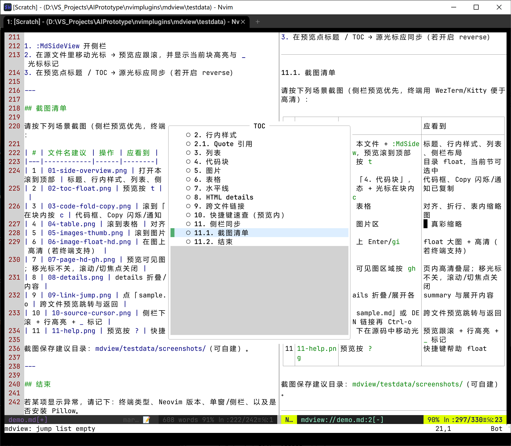
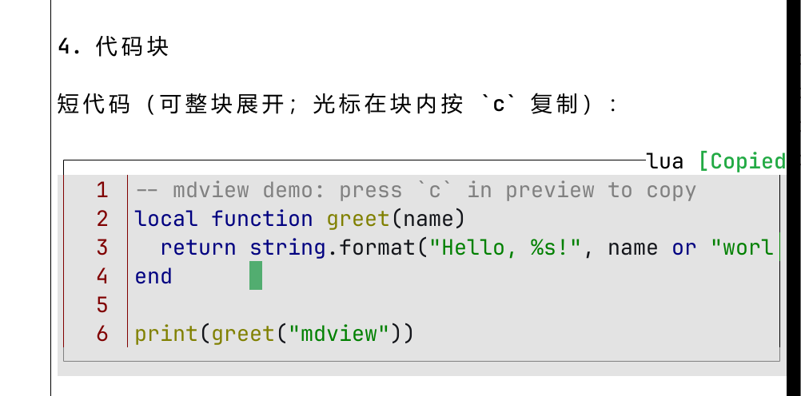
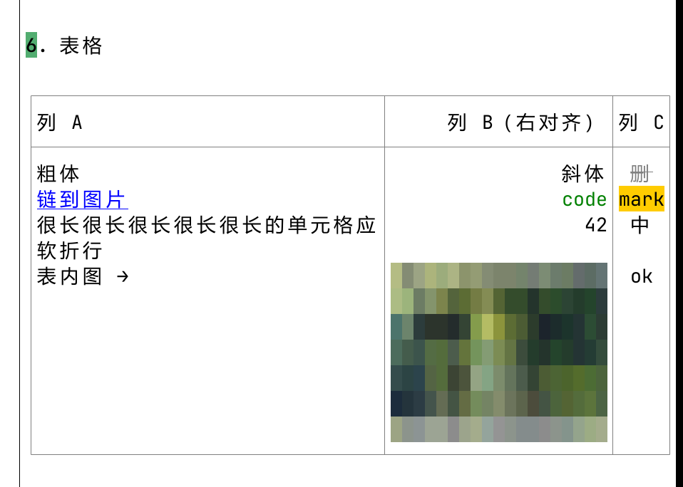
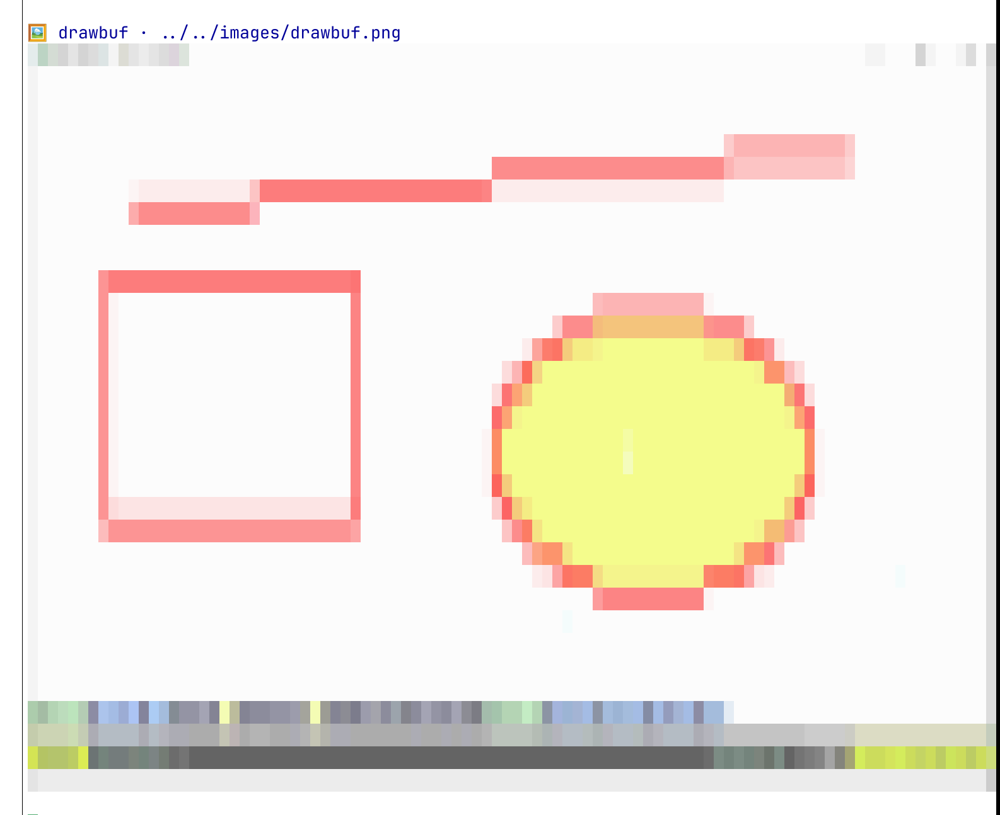
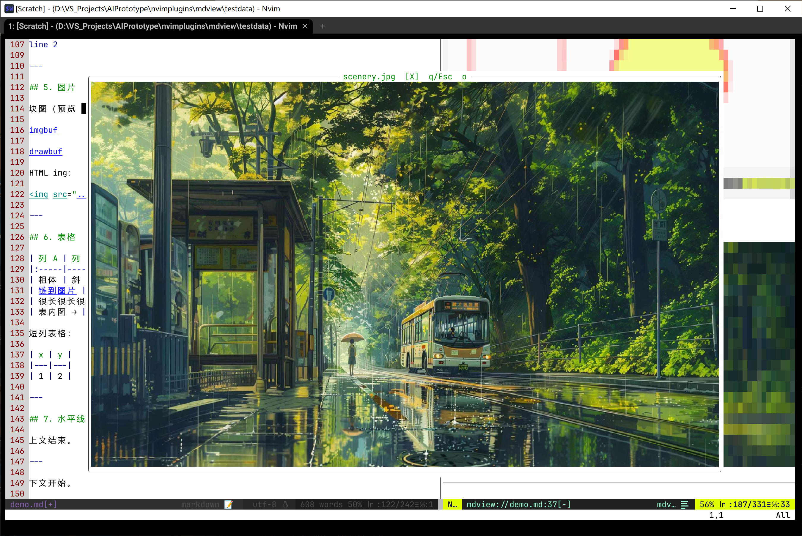
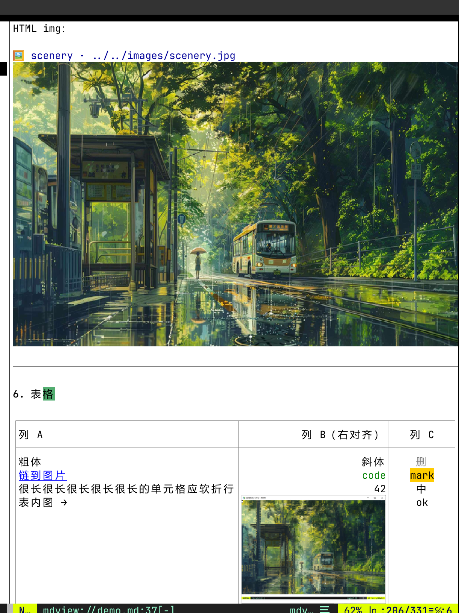
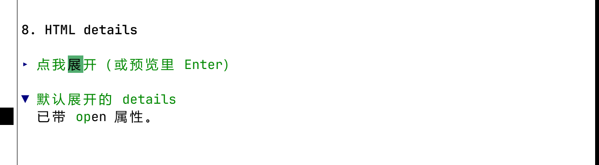
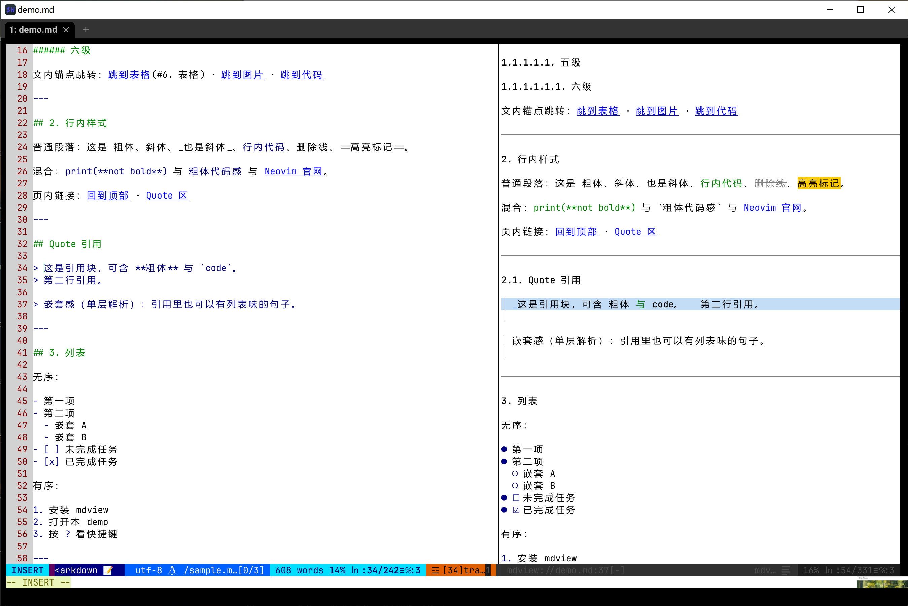
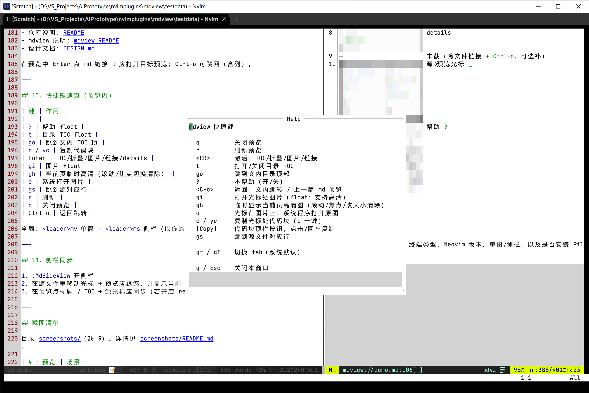

# mdview 完整功能演示

> 打开本文件后执行 `:MdSideView` 或 `:MdView`，对照 [README](../../README.md) / 预览键 `?`。  
> **截图建议见文末「截图清单」**。

---

## 1. 标题层级

### 1.1. 三级标题

#### 1.1.1. 四级标题

##### 五级

###### 六级

文内锚点跳转：[跳到表格](#6. 表格) · [跳到图片](#5. 图片) · [跳到代码](#4. 代码块)

---

## 2. 行内样式

普通段落：这是 **粗体**、*斜体*、_也是斜体_、`行内代码`、~~删除线~~、==高亮标记==。

HTML 字体色：<font color='#f00' style="background:#0f0">红字绿底</font> · <font color="#00aaff">仅前景</font> · <font style="font-weight:bold;font-style:italic">粗斜体</font> · <font color="#c00" style="font-weight:bold">红粗</font>。

混合：`print(**not bold**)` 与 **`粗体代码感`** 与 [Neovim 官网](https://neovim.io)。

页内链接：[回到顶部](#mdview-完整功能演示) · [Quote 区](#Quote 引用) · [列表](#3. 列表)

---

## Quote 引用

> 这是引用块，可含 **粗体** 与 `code`。  
> 第二行引用。

> 嵌套感（单层解析）：引用里也可以有列表味的句子。

---

## 3. 列表

无序：

- 第一项
- 第二项
  - 嵌套 A
  - 嵌套 B
- [ ] 未完成任务
- [x] 已完成任务

有序：

1. 安装 mdview
2. 打开本 demo
3. 按 `?` 看快捷键

---

## 4. 代码块

短代码（可整块展开；光标在块内按 **`c`** 复制）：

```lua
-- mdview demo: press `c` in preview to copy
local function greet(name)
  return string.format("Hello, %s!", name or "world")
end

print(greet("mdview"))
```

长代码（超过折叠阈值时顶栏可折叠；块内任意位置 **Enter** 切换展开）：

```python
"""Fold / Copy demo — press c to copy whole block."""

def fib(n: int) -> list[int]:
    a, b = 0, 1
    out = []
    for _ in range(n):
        out.append(a)
        a, b = b, a + b
    return out


def main() -> None:
    print("fib(12) =", fib(12))
    for i in range(1, 15):
        print(i, "->", fib(i)[-1] if fib(i) else None)


if __name__ == "__main__":
    main()
    # padding lines for fold threshold
    # 11
    # 12
    # 13
    # 14
    # 15
```

无语言围栏：

```
plain text fence
line 2
```

---

## 5. 图片

块图（预览内用色块字符渲染；**Enter / gi** 开 float 大图；float 内 **o** 系统打开）：


HTML img：


---

## 6. 表格

| 列 A | 列 B（右对齐） | 列 C |
|:-----|---------------:|:----:|
| **粗体** | _斜体_ | ~~删~~ |
| [链到图片](#5-图片) | `code` | ==mark== |
| 很长很长很长很长很长的单元格应软折行 | 42 | 中 |
| 表内图 → |  | ok |

短列表格：

| x | y |
|---|---|
| 1 | 2 |

---

## 7. 水平线

上文结束。

---

下文开始。

---

## 8. HTML details

<details>
<summary>点我展开（或预览里 Enter）</summary>

里面可以有 **markdown 风格** 文字与列表：

- alpha
- beta

```js
console.log("inside details")
```

</details>

<details open>
<summary>默认展开的 details</summary>

已带 `open` 属性。

</details>

---

## 9. 跨文件链接

- 仓库说明：[README](../../README.md)
- mdview 说明：[mdview README](../README.md)

在预览中 **Enter** 点 md 链接 → 应打开**目标预览**；**Ctrl-o** 可跳回（含列）。

---

## 10. 快捷键速查（预览内）

| 键 | 作用 |
|----|------|
| `?` | 帮助 float |
| `t` | 目录 TOC float |
| `go` | 跳到文内 TOC 顶 |
| `c` / `yc` | **复制代码块** |
| Enter | TOC/折叠/图片/链接/details |
| `gi` | 图片 float |
| `gh` | 当前页临时高清（滚动/焦点切换清除） |
| `o` | 系统打开图片 |
| `gs` | 跳到源对应行 |
| `r` | 刷新 |
| `q` | 关闭预览 |
| Ctrl-o | 返回跳转 |

全局：`<leader>mv` 单窗 · `<leader>ms` 侧栏（以你的 `setup.keys` 为准）。

---

## 11. 侧栏同步

1. `:MdSideView` 开侧栏  
2. 在**源文件**里移动光标 → 预览应跟滚，并显示当前块高亮与 **`_`** 光标标记  
3. 在预览点标题 / TOC → 源光标应同步（若开启 reverse）

---

## 截图清单

目录 [`screenshots/`](./screenshots/)（**缺 9**）。详情见 [screenshots/README.md](./screenshots/README.md)。

| # | 预览 | 场景 |
|---|------|------|
| 1 |  | 侧栏总览 |
| 2 |  | TOC float（`t`） |
| 3 |  | 代码块 / `c` 复制 |
| 4 |  | 表格 |
| 5 |  | 图片用色块字符渲染 |
| 6 |  | float 高清（`gi`） |
| 7 |  | 页内高清（`gh`） |
| 8 |  | details |
| 9 | — | **未截**（跨文件链接 + `Ctrl-o`，可选补） |
| 10 |  | 源→预览光标 `_` |
| 11 |  | 帮助 `?` |

---

## 结束

若某项显示异常，请记下：终端类型、Neovim 版本、单窗/侧栏、以及是否安装 Pillow。
