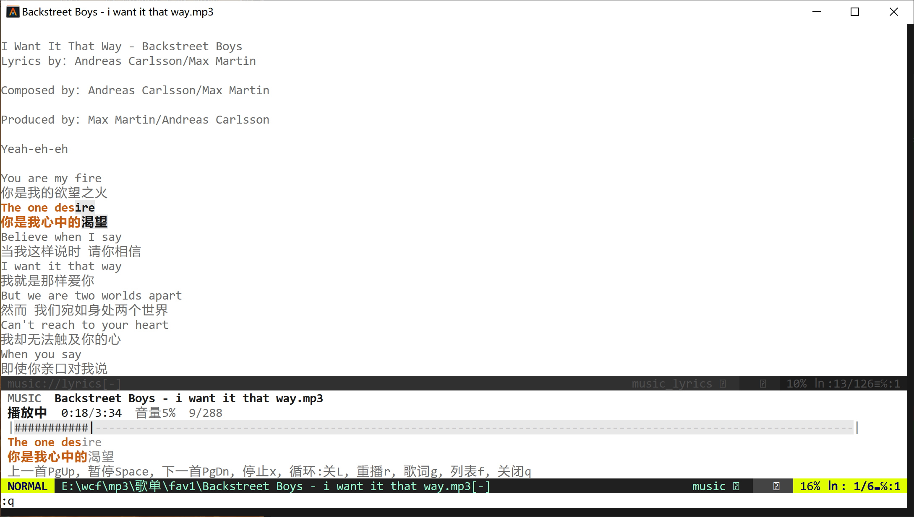

# music.nvim

**English** | [中文](README.zh.md)

Open an **audio file** and turn the **buffer** into a simple player (similar to how imgbuf opens images).



No separate playlist concept: prev/next = **same-directory** neighbors (`PgUp` / `PgDn`; `f` opens a list to pick).

## Playback backend (Python)

Not a one-shot **mpv / ffplay** process. Starts a **long-lived** `scripts/player.py` controlled via stdin/stdout JSON:

| Capability | Notes |
|------------|-------|
| Play / pause / resume | In-process |
| Seek | Absolute seconds (progress drag) |
| Volume | 0–100 live |
| Duration | mutagen (optional) / wav / ffprobe (optional) |

Engine priority:

1. **just_playback** (**preferred** — stabler seek/progress/volume)
2. **pygame** (auto fallback with a warning if just_playback is missing)

```text
pip install just_playback
# optional fallback / duration:
pip install pygame mutagen
```

> From Neovim you still `jobstart` one Python process, but it is a **controllable daemon**, not an opaque ffplay window.

## Features

| Feature | Description |
|---------|-------------|
| Open to play | `:e song.mp3` / `:Music song.mp3` |
| Controls | Play, pause, replay, stop |
| Same-folder nav | Next / prev (sorted by filename) |
| Time | `current / total` (m:ss) |
| Progress bar | **Click / drag** to seek |
| Global singleton | One player buffer; opening in another tab closes the old window |
| Show/hide UI | `Alt+M` (configurable); **bottom split, no focus steal**; keeps playing when hidden |
| Hidden statusline | With `statusline_when_hidden`: `[title,1:22/3:33]` |
| Session restore | Folder, file, progress saved on close/exit |
| Dirty refresh | Progress/lyrics redraw by line — no full-buffer flicker |
| Auto height | Shrink height only for **horizontal** splits when other windows exist |
| Text buttons | No emoji; shortcuts labeled |
| No scroll | View locked; j/k blocked |

## Dependencies

| Component | Requirement |
|-----------|-------------|
| Neovim | 0.9+ (0.10+ recommended) |
| Python 3 | `python` on `PATH` |
| Audio libs | **just_playback** (preferred); **pygame** fallback |

```text
pip install just_playback
pip install pygame      # optional fallback
pip install mutagen     # optional duration for more formats
```

Optional: `ffprobe` for duration fallback.

Mouse: `set mouse=a` (progress drag; auto-enabled if empty).

## Install (vim-plug)

**No** `setup()` required.

```vim
call plug#begin()
Plug '/path/to/nvimplugins/music'
call plug#end()

" optional
" lua require('music').setup({ volume = 80, python = 'python' })
```

## Usage

```vim
:e D:/Music/track.mp3
:Music D:/Music/track.mp3
:MusicToggle
:MusicNext
:MusicPrev
:MusicStop
```

### Keys / clickable labels

Example action row: `Prev PgUp, Play Space, Next PgDn, Stop x, Loop:off L, Replay r, Lyrics g, List f, Quit q`

| Action | Key |
|--------|-----|
| Play/pause | `Space` |
| Prev/next | `PgUp` / `PgDn` |
| Stop | `x` |
| Loop | `L` |
| Replay | `r` |
| Lyrics | `g`: full lyrics split above; current line embedded (CN/EN highlight together) |
| List | `f`: same-folder track list; focus moves to list |
| Focus swap | `Tab`: player ↔ list (when list open) |
| Close & stop | `q` |
| Seek | Drag bar; `h`/`l` ±5s |
| Volume | `+/-`, up/down, wheel |
| Show/hide UI | `Alt+M` (keeps playing when hidden) |

### Track list (`f`)

| Action | Key |
|--------|-----|
| Move | `↑`/`↓` (or `k`/`j`) |
| Page | `PgUp` / `PgDn` |
| Play selection | `Space` / `Enter` / double-click (**list auto-closes**) |
| Click | Select only |
| Close list | `f` / `q` |
| Back to player | `Tab` |

### Lyrics files

Same folder, same stem: `song.mp3` → `song.lrc` (standard LRC timestamps):

```text
[00:12.00]line one
[00:15.50]line two
```

- CN/EN lines with the same timestamp highlight **together** (≤ 0.08s treated as a pair).
- Embedded lyrics: sung part **deep orange**, rest gray (intra-line progress estimate).
- In lyrics window, `q`/`g` closes.

## Config (optional)

```lua
require("music").setup({
  volume = 70,
  auto_open = true,
  auto_play = true,
  auto_next = true,
  loop = false,
  fit_height = true,
  toggle_key = "<M-m>", -- Alt+M show/hide
  poll_ms = 100,        -- ~10 fps progress/lyrics
  statusline_when_hidden = false,
  python = "python",
})
```

With `statusline_when_hidden = true`:

- Writes `g:music_statusline` and tries to attach to `statusline`.
- Or use `%{g:music_statusline}` / `require('music').statusline()` (lualine, etc.).

Session file: `stdpath("data")/music-nvim-session.json`.

## Notes

- **`Alt+M` hide** keeps **playback**; show again leaves focus on the code window.
- Opening lyrics also **returns focus** to the code window.
- With no player, `Alt+M` / bare `:Music` restores last file + position.
- **`q` close** stops playback and deletes the buffer (session still saved).
- Leaving Neovim saves session and stops the Python daemon.
- Auto height only shrinks when other windows share the vertical space.
- UI uses **dirty** line/highlight updates — progress polling does not rewrite the whole buffer.

## Related

- Repo overview: [English](../README.md) · [中文](../README.zh.md)
