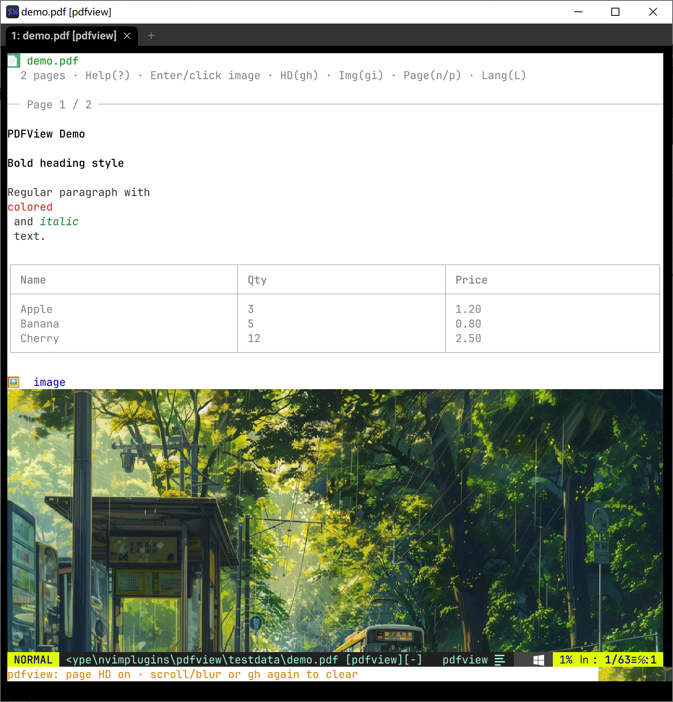

# pdfview.nvim

**English** | [中文](README.zh.md)

Open **PDF / Word** files inside Neovim as a **structured preview** (not raw binary, not full-page screenshots).

- Text: **color / bold / italic** (and monospace)
- Images: **chafa** by default; **Enter / click / `gi`** opens a float with **HD overlay when supported** (same path as mdview)
- Tables: Unicode borders
- `gh`: temporary page HD (clears on scroll/blur)

Demos:

- PDF: [`testdata/demo.pdf`](./testdata/demo.pdf)
- Word: [`testdata/demo.docx`](./testdata/demo.docx)



## Features

| Feature | Notes |
|---------|--------|
| Auto-open | `.pdf` / `.docx` / `.doc` (`auto_open`) |
| Text styles | Per-span/run color, bold, italic, mono |
| Tables | PDF `find_tables`; Word `w:tbl` |
| Images | chafa default; Pillow fallback |
| Enter / click / `gi` | Image float + `attach_float` HD when available |
| `gh` | Temporary HD for visible images |
| Pages | `n` / `]` next, `p` / `[` prev (PDF) |

## Dependencies

| Component | Role |
|-----------|------|
| Neovim 0.9+ | Host |
| Python 3 + **PyMuPDF** | PDF extract |
| Python 3 (stdlib) | **DOCX** extract (zip + xml) |
| LibreOffice `soffice` (optional) | Legacy **.doc** → docx |
| **chafa** (recommended) | In-preview image blocks |
| Pillow (optional) | Thumb fallback; HD encode |
| WezTerm / Kitty / Ghostty | Float / `gh` pixel HD |

```bash
pip install pymupdf Pillow
```

## Install

```vim
Plug '/path/to/nvimplugins/pdfview'
" or whole-repo: Plug 'cfwang123/nvimplugins'
```

```vim
:PdfView
:DocView /path/to/file.docx
:PdfViewRefresh
:PdfViewClose
```

## Keys

| Key | Action |
|-----|--------|
| `q` / `Esc` | Close |
| `r` | Re-extract + render |
| `n` / `]` | Next page (PDF) |
| `p` / `[` | Prev page (PDF) |
| **Enter / click** | Image float (+ HD if supported) |
| `gi` | Same |
| `gh` | Temporary page HD |
| `o` | System-open document or image |
| `?` | Help |

## Config

```lua
require("pdfview").setup({
  auto_open = true,
  python = "python",
  image = {
    backend = "chafa",
    open_with = "float",
    float_scale = "fill",
    float_hd = "always",
  },
})
```

## Limits

- Scanned PDFs are mostly images  
- Complex layouts may reorder  
- `.doc` needs LibreOffice; prefer `.docx`  
- HD needs graphics-protocol terminals  
