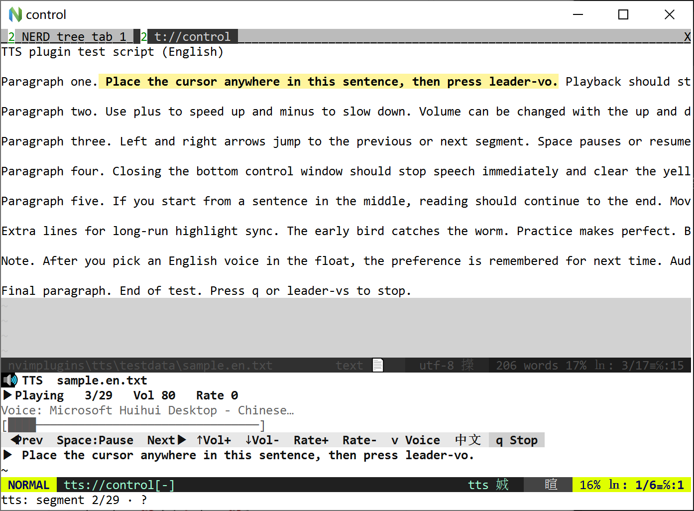

# tts.nvim

[English](README.md) | **中文**

用 **Windows SAPI** 做文本转语音：命令播放、buffer 预览跟读、选区朗读（发音人可记住）。



## 依赖

| 组件 | 说明 |
|------|------|
| Windows | 系统自带 SAPI 语音 |
| Neovim 0.9+ | |
| Python3 + **pywin32** | `pip install pywin32` |

已安装语音示例：Huihui（中文）、Zira/David（英文）。可在「设置 → 时间和语言 → 语音」添加更多。

## 安装

```vim
Plug '/path/to/nvimplugins/tts'
" 或整仓 nvimplugins（已包含 tts）
```

## 用法

| 操作 | 说明 |
|------|------|
| `:TTS 你好世界` | 播放文本（短句可不弹预览） |
| `:TTS` | 播放当前行 |
| **normal** `<leader>vo` | 从**光标所在段**开始播放；底部控制条 + 原文黄底高亮。播放中再按可跳到新光标段 |
| **visual** `<leader>vo` | 播放选中文本（沿用当前/上次发音人） |
| `<leader>vs` | **停止**所有语音并关闭控制条 |
| `:TTSStop` | 同上 |
| `:TTSVoices` | 列出 SAPI 发音人 |

### 控制条

- 不展示全文，只显示状态 / 进度 / **可点击按钮**
- 当前段在**源窗口**以**亮黄色背景**高亮
- 点「发音人」打开 **float** 列表选择（Enter / 点击）

| 键 / 按钮 | 作用 |
|-----------|------|
| `←` / `→` | 上一段 / 下一段 |
| `↑` / `↓` | 音量 + / − |
| **滚轮** | 音量 + / − |
| `+` / `-`（或 `=` / `[` `]` / `Shift+↑↓`） | 语速 + / −（SAPI -10…10；控制条与源 buffer 均可） |
| `Space` | 暂停 / 继续 |
| `v` | float 选发音人 |
| **`EN` / `中文` 按钮** 或 `L` | 切换控制条中/英文界面（默认跟系统语言，并记住） |
| `q` | 停止并退出 |

控制窗禁止选字；播放结束后清除原文高亮。**关闭控制窗**（`:q` / `Ctrl-W c` 等）会立即停止朗读并清除高亮。音频走 **Windows 当前默认播放设备**（切换扬声器后下一段生效）。

## 配置

```lua
require("tts").setup({
  python = "python",
  volume = 80,       -- 0–100
  rate = 0,          -- -10..10
  keys_play = "<leader>vo",
  keys_stop = "<leader>vs",
  -- 控制条界面语言："auto"（跟随系统）| "zh" | "en"
  -- ui_lang = "auto",
  -- 可选：默认发音人（子串匹配）；float 选择后会记住到 data/tts-nvim-prefs.json
  -- voice = "Huihui",
})
```

**发音人：** 不自动按语言切换。float 里选过一次后写入 `stdpath("data")/tts-nvim-prefs.json`，下次启动仍用同一发音人。

**界面语言：** 默认按系统 UI 语言；控制条上点 **EN** / **中文**（或按 `L`）切换，并写入 prefs。

关闭默认键：

```lua
require("tts").setup({
  keys_play = false,
  keys_stop = false,
})
```

## 说明

- 文本按句号 / 换段切分；预览中当前段高亮  
- 语言检测：CJK 占比高 → 中文发音人，否则英文  
- 需在 **Windows** 上运行；其它系统无 SAPI  
