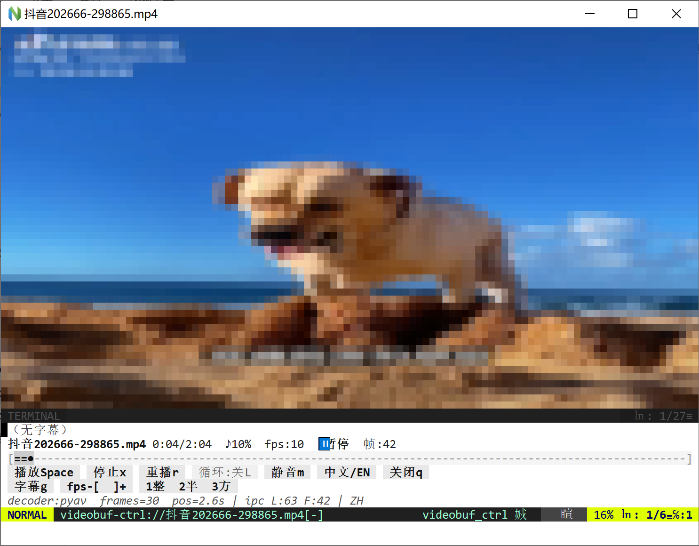

# videobuf.nvim

**English** | [中文](README.zh.md)

In-Neovim video preview/playback: character-art frames above, lyrics + control bar below (aligned with **music** / **imgbuf**).



## Features (summary)

- Open a video into a preview buffer (`:Videobuf` / optional auto-open)
- Play / pause / stop / replay, seek, volume, loop
- Adjustable FPS; timed lyrics (current line highlight)
- zh/en UI: **`L`** (or control-bar language button); loop key **`o`**

## Dependencies

- Neovim 0.9+
- Python3 + decode stack (see `scripts/videod.py`)

## Install

```vim
Plug '/path/to/nvimplugins/videobuf'
" or whole-repo nvimplugins (includes videobuf by default)
```
